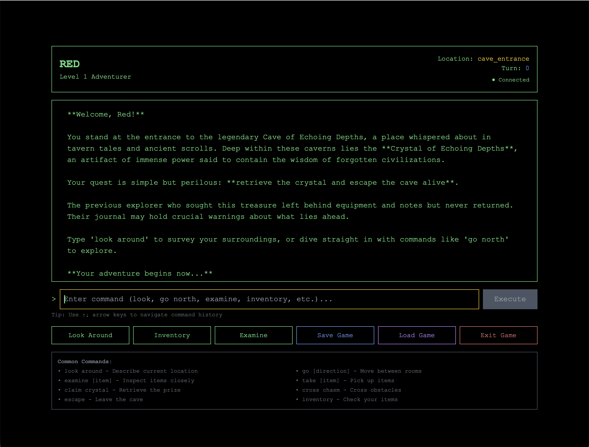

# Multi-Agent AI Text Adventure

> A production-ready demonstration of agentic AI patterns using PydanticAI



[]() []() []() []()

## Overview

This project demonstrates **agentic AI architecture patterns** using the [PydanticAI](https://ai.pydantic.dev) framework. Rather than building yet another chatbot, it showcases how multiple AI agents can collaborate to create a dynamic, context-aware system through the engaging medium of a text-based adventure game.

**Why a text adventure?** Games provide:

- ✅ Clear success criteria (did the AI understand the command?)
- ✅ Engaging way to demonstrate AI capabilities
- ✅ Complex state management showing real-world patterns
- ✅ Natural language processing challenges
- ✅ Multi-turn conversations with context

**The real value** is in the AI architecture patterns demonstrated, not the game itself.

## What This Demonstrates

This project implements agentic AI capabilities:

| AI Pattern             | Implementation                                      | PydanticAI Concept                   | Location                                                            |
| ---------------------- | --------------------------------------------------- | ------------------------------------ | ------------------------------------------------------------------- |
| **Classification**     | Intent parsing from natural language                | Structured output with `output_type` | [`intent_parser.py`](backend/app/agents/intent_parser.py)           |
| **Orchestration**      | Coordinator agent delegates to specialists          | Agent composition & delegation       | [`adventure_narrator.py`](backend/app/agents/adventure_narrator.py) |
| **Specialist Agents**  | Domain-specific agents (rooms, inventory, entities) | Multiple agent instances             | [`agents/`](backend/app/agents/)                                    |
| **Tool Calling**       | Agents invoke domain tools based on context         | `@tool` decorator pattern            | All agent files                                                     |
| **RAG (Retrieval)**    | Vector DB provides dynamic context to agents        | Tool-based context injection         | [`rag_tools.py`](backend/app/tools/rag_tools.py)                    |
| **State Management**   | Session state tracked and updated by agents         | Agent context & dependencies         | [`main.py`](backend/app/main.py)                                    |
| **Multi-Turn Context** | Agents maintain conversation history                | Session-based state persistence      | Redis integration                                                   |
| **Error Handling**     | Graceful degradation when AI encounters issues      | Try-catch with fallback responses    | All agent implementations                                           |

## Architecture & Components

### System Diagram

```mermaid
graph TB
    Player[👤 Player Command<br/>'grab the shiny crystal']

    subgraph Classification["🎯 Classification Pattern"]
        IntentParser[IntentParser Agent<br/>GPT-4o-mini]
    end

    subgraph Orchestration["🎭 Orchestration Pattern"]
        Narrator[AdventureNarrator<br/>Coordinator & Composer]
    end

    subgraph Specialists["⚙️ Specialist Pattern"]
        Room[RoomDescriptor<br/>Environment Expert]
        Inventory[InventoryManager<br/>Items Expert]
        Entity[EntityManager<br/>NPC/Creature Expert]
    end

    subgraph RAG["📚 RAG Pattern"]
        Tools[RAG Tools<br/>ChromaDB Vector Search]
    end

    subgraph Storage["💾 Persistence Layer"]
        Redis[(Redis<br/>Sessions)]
        Postgres[(PostgreSQL<br/>Game State)]
    end

    subgraph Frontend["🖥️ Presentation"]
        UI[Next.js WebSocket UI]
    end

    Player -->|Natural Language| IntentParser
    IntentParser -->|ParsedCommand<br/>{type: pickup, target: crystal}| Narrator
    Narrator -->|Delegates| Room
    Narrator -->|Delegates| Inventory
    Narrator -->|Delegates| Entity
    Room -->|query_world_lore| Tools
    Inventory -->|examine_item| Tools
    Entity -->|interact_with_entity| Tools
    Tools -->|Context Retrieval| Room
    Tools -->|Context Retrieval| Inventory
    Tools -->|Context Retrieval| Entity
    Narrator -->|Save/Load State| Redis
    Narrator -->|Persist Discoveries| Postgres
    Narrator -->|Composed Response| UI
    UI -->|Real-time Updates| Player

    classDef agentStyle fill:#1f6feb,stroke:#58a6ff,color:#fff
    classDef toolStyle fill:#238636,stroke:#2ea043,color:#fff
    classDef storageStyle fill:#8957e5,stroke:#a371f7,color:#fff
    classDef uiStyle fill:#bc4c00,stroke:#fb8500,color:#fff

    class IntentParser,Narrator,Room,Inventory,Entity agentStyle
    class Tools toolStyle
    class Redis,Postgres storageStyle
    class UI uiStyle
```

### Components Overview

- **Frontend**: Next.js React application with command-line interface and real-time WebSocket integration for live game updates
- **Backend**: FastAPI server that acts as the adventure engine and game state manager
- **Agents**: Typed PydanticAI agents with clear responsibilities and tools
- **RAG**: ChromaDB vector store seeded with chunked room descriptions, item details, and world lore; embeddings used for rich narrative retrieval
- **Memory**: Short-term game state in Redis for save/load functionality; long-term discovery memory in PostgreSQL with embeddings for world persistence
- **Tools**: Utility functions exposed to agents (RAG queries, state management, inventory operations)
- **Content**: Markdown files containing room descriptions, item catalogs, and environmental details

### Agents & Responsibilities

| Agent                 | Purpose                                                               | Key Tools                                    | Pattern          |
| --------------------- | --------------------------------------------------------------------- | -------------------------------------------- | ---------------- |
| **IntentParser**      | Classifies natural language commands into structured intents          | N/A (pure AI classification)                 | Classification   |
| **AdventureNarrator** | Orchestrates game flow, delegates to specialists, composes narratives | `parse_command`, agent delegation            | Orchestration    |
| **RoomDescriptor**    | Generates rich environmental descriptions using RAG                   | `query_world_lore`, `get_room_connections`   | Specialist + RAG |
| **InventoryManager**  | Manages item interactions (pickup, drop, examine, use)                | `update_inventory`, `examine_item`           | Specialist       |
| **EntityManager**     | Handles NPCs, creatures, and interactive elements                     | `interact_with_entity`, `check_entity_state` | Specialist       |

### Tools Available to Agents

| Tool                     | Purpose                                       | Used By                           |
| ------------------------ | --------------------------------------------- | --------------------------------- |
| **query_world_lore**     | Searches ChromaDB for relevant world content  | RoomDescriptor, EntityManager     |
| **get_room_connections** | Returns available exits from current location | RoomDescriptor, AdventureNarrator |
| **update_inventory**     | Add/remove items from player inventory        | InventoryManager                  |
| **examine_item**         | Get detailed item descriptions                | InventoryManager                  |
| **check_ability**        | Validate if player can use class ability      | AdventureNarrator                 |
| **interact_with_entity** | Handle NPC/creature interactions              | EntityManager                     |

## 🚀 Quick Start

### Prerequisites

- Docker and Docker Compose
- Git

### Setup

1. **Clone the repository:**

   ```bash
   git clone <repository-url>
   cd agentic_ai_rpg_demo
   ```

2. **Configure environment:**

   ```bash
   cp .env.example .env
   # Edit .env and add your OpenAI API key:
   # OPENAI_API_KEY=sk-your-key-here
   ```

3. **Setup vector database (one-time):**

   ```bash
   # This generates embeddings and creates the vector database
   # Requires OpenAI API key - only run once per world content change
   ./scripts/setup-vectors.sh
   ```

4. **Launch the application:**

   ```bash
   docker-compose up
   ```

The application will be available at:

- **Frontend**: http://localhost:3000 (Next.js game UI)
- **Backend API**: http://localhost:8001 (FastAPI docs)
- **ChromaDB**: http://localhost:8000 (Vector database)

## 🧠 Vector Database Strategy

This project uses a **pre-generate and mount** approach for vector embeddings:

### Why This Approach?

- **Cost efficient**: Generate OpenAI embeddings once, reuse across environments
- **Fast startup**: No API calls needed when launching Docker containers
- **Consistent data**: Same embeddings across development/production environments
- **Git friendly**: World content is versioned, vector binaries are gitignored

### Setup Process:

1. **One-time setup**: `./scripts/setup-vectors.sh` generates embeddings locally
2. **Mount data**: Docker mounts `./chroma_data` into ChromaDB container
3. **Persist changes**: Vector data persists between container restarts

### File Structure:

```
├── backend/app/world_data/     # ✅ World content (versioned)
│   ├── rooms/*.md
│   └── items/*.md
├── chroma_data/               # ❌ Vector files (gitignored)
│   ├── chroma.sqlite3
│   └── *.bin
└── scripts/setup-vectors.sh   # ✅ Setup script (versioned)
```

cp .env.example .env

# Edit .env with your OpenAI API key

````

3. **Start the services:**

```bash
docker-compose up -d
````

4. **Verify setup:**

   ```bash
   # Check all services are running
   docker-compose ps

   # Test API health
   curl http://localhost:8001/health
   ```

## 🧪 Testing

The project uses a comprehensive testing strategy with both **mocked unit tests** and **toggle-able integration tests**.

### Test Structure

```
backend/tests/
├── __init__.py
├── test_sessions_unit.py      # Fast mocked unit tests
└── test_sessions_integration.py  # Real HTTP integration tests
```

### Running Tests

#### Option 1: Using Development Workflow Script (Recommended)

```bash
# Show all available commands
./scripts/dev.sh

# Run specific commands
./scripts/dev.sh test        # Run all tests
./scripts/dev.sh test-unit   # Run unit tests only
./scripts/dev.sh test-int    # Run integration tests only
./scripts/dev.sh lint        # Check code quality
./scripts/dev.sh status      # Show service status
```

#### Option 2: Using Individual Helper Scripts

```bash
# Run unit tests only (fast, mocked)
./scripts/test-unit.sh

# Run integration tests (requires running services)
./scripts/test-integration.sh

# Run all tests
./scripts/test-all.sh

# Check code quality
./scripts/lint.sh
```

#### Option 3: Manual Commands

```bash
# Start services first
docker-compose up -d

# Unit tests only (external calls mocked)
docker-compose exec backend python -m unittest tests.test_sessions_unit -v

# Integration tests (real HTTP calls)
docker-compose exec -e RUN_INTEGRATION_TESTS=1 backend python -m unittest tests.test_sessions_integration -v

# All tests (unit + integration when flag set)
docker-compose exec backend python -m unittest discover -v
docker-compose exec -e RUN_INTEGRATION_TESTS=1 backend python -m unittest discover -v

# Code quality check
docker-compose exec backend pylint app/ tests/
```

### Test Philosophy

- **Unit Tests**: Fast, isolated, mock external dependencies (Redis, HTTP calls)
- **Integration Tests**: Slower, real HTTP calls, full workflow validation
- **CI/CD Friendly**: Integration tests disabled by default, enabled with `RUN_INTEGRATION_TESTS=1`

## 🎯 API Endpoints

### Health & Info

- `GET /` - API status and service connectivity
- `GET /health` - Simple health check

### Character System

- `GET /character/classes` - Available character classes with stats
- `POST /character/create` - Create a new character
- `GET /character/stats/{class}` - Get stat template for character class

### Game Sessions

- `POST /game/start` - Start new game session with character
- `POST /game/{id}/command` - Send command to game session
- `GET /game/{id}/state` - Get current game session state

## 🔧 Development

### Project Structure

```
├── backend/                 # FastAPI application
│   ├── app/
│   │   ├── main.py         # Main FastAPI app with endpoints
│   │   ├── agents/         # PydanticAI agents (coming soon)
│   │   └── __init__.py
│   ├── tests/              # Comprehensive test suite
│   └── requirements.txt
├── frontend/               # Next.js application
├── scripts/               # Development helper scripts
│   ├── dev.sh             # Main development workflow script
│   ├── setup.sh           # Initial project setup
│   ├── test-all.sh        # Run all tests (unit + integration)
│   ├── test-unit.sh       # Run unit tests only
│   ├── test-integration.sh # Run integration tests only
│   └── lint.sh            # Code quality checks
└── docker-compose.yml     # Multi-service Docker setup
```

### Adding New Features

1. **Write tests first** (TDD approach)
2. **Unit tests** for business logic (use mocks)
3. **Integration tests** for API workflows
4. **Run linting** before committing
5. **Update documentation** as needed

### Location Name Handling

The system uses **automatic normalization** for location names:

- **Display format**: "Cave Entrance", "Yawning Chasm" (human-readable, Title Case)
- **Storage format**: `cave_entrance`, `yawning_chasm` (snake_case for metadata)
- **Automatic conversion**: Use either format anywhere - the system normalizes internally

```python
# All of these work and return the same results:
query_world_lore("cave description", "Cave Entrance")
query_world_lore("cave description", "cave_entrance")
get_room_description("Yawning Chasm")
get_room_description("yawning_chasm")
```

**Known locations** (defined in `app/utils/location_utils.py`):

- Cave Entrance
- Hidden Alcove
- Yawning Chasm
- Crystal Treasury
- Collapsed Passage

### Environment Variables

Key variables in `.env`:

- `OPENAI_API_KEY` - Required for PydanticAI agents
- `DATABASE_URL` - PostgreSQL connection for persistence
- `REDIS_URL` - Redis connection for session management
- `CHROMA_URL` - ChromaDB for vector embeddings

## 🐳 Docker Services

| Service  | Port | Purpose            |
| -------- | ---- | ------------------ |
| frontend | 3000 | Next.js UI         |
| backend  | 8001 | FastAPI API        |
| postgres | 5432 | Persistent storage |
| redis    | 6379 | Session management |
| chroma   | 8000 | Vector database    |

## 📚 Tech Stack

- **Backend**: FastAPI, PydanticAI, Redis, PostgreSQL
- **Frontend**: Next.js, React, TypeScript
- **AI/ML**: PydanticAI, ChromaDB, OpenAI
- **Testing**: unittest, httpx, mocking
- **Infrastructure**: Docker Compose, Python 3.11

## 📝 License

This project is for demonstration purposes.

---

**Happy adventuring!** 🗡️🧙‍♂️🏹
